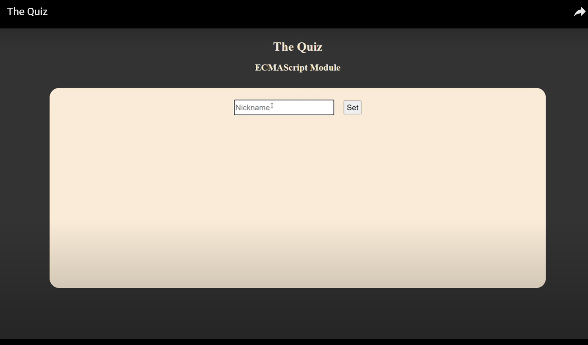

# The Quiz


The quiz is a single-page client application where users answer quiz questions served by a server using a RESTful API. The user's answers are validated by the server, and the game progresses based on their correctness.

## How it Works

- At the start of the game, the user enters a nickname to participate in the quiz.
- The game presents a series of questions, and the user has 20 seconds to answer each question.
- If the user answers correctly, they move on to the next question.
- If the user provides a wrong answer or does not answer within the time limit, the quiz ends, and the high score list is displayed.
- If the user answers all questions correctly, their total time is recorded and added to the high-score list, which displays the five quickest attempts.
- The high score is saved in the browser's Web Storage for persistence.

## Features

- **Single-Page Application (SPA):** The entire quiz experience is contained within a single page, ensuring a smooth user experience without page reloads.
- **Timer:** A countdown timer is implemented to give users a maximum of 20 seconds per question.
- **High Score:** The user's performance is tracked, and the top five fastest times are saved and displayed.
- **Web Storage:** High scores are saved using the browser's Web Storage, so they persist across sessions.

## Demo video
[](https://www.youtube.com/watch?v=NVvOf7MBz90)

## Installation and Usage

1. **Development Mode:**
```
npm run dev
```

Starts the development server using Vite.

2. **Build for Production:** 
```
npm run build
```

Builds the project for production.

3. **Linting:**
```
npm run lint
```

Runs ESLint to check for code quality issues.

4. **Fix Linting Issues:**
```
npm run lint:fix
```

Automatically fixes linting issues where possible.

## License
This project is licensed under the MIT License.

## Contributors
Johan Leitet - johan.leitet@lnu.se
Mats Loock - mats.loock@lnu.se
Vanja Maric - maricvanj@gmail.com

## Contact
For any questions or suggestions, feel free to contact me (Vanja Maric) at:

Email: maricvanj@gmail.com
